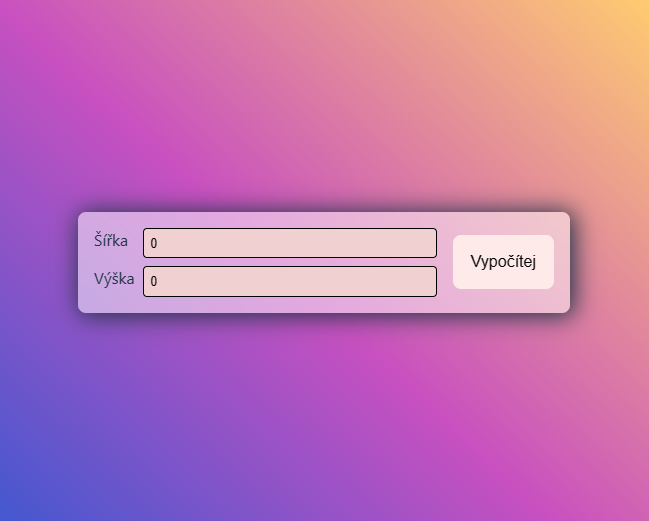
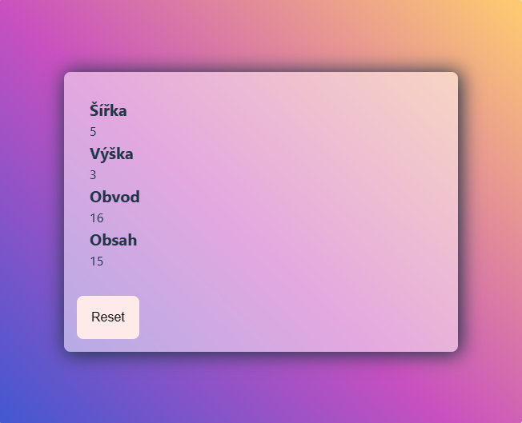
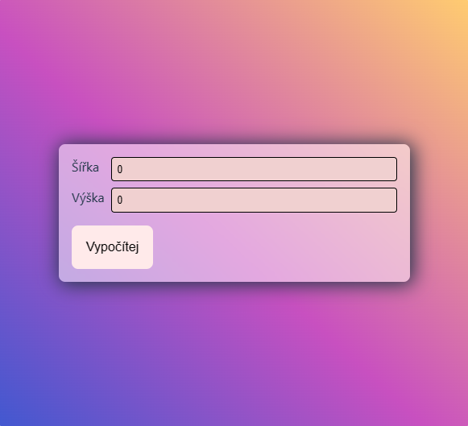
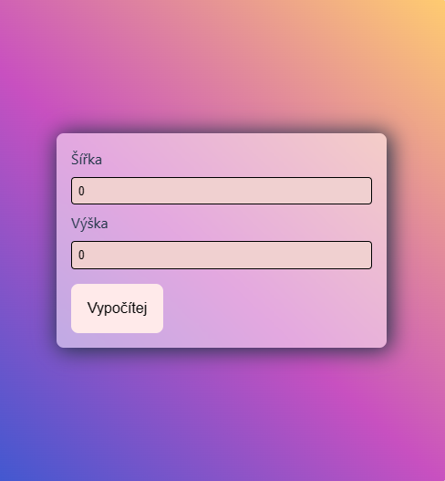
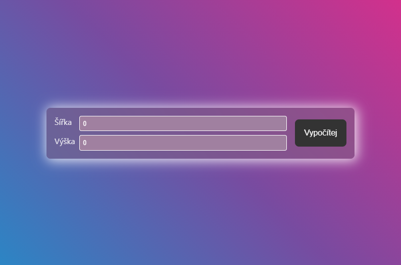

# Obvod a povrch obdélníku pomocí Reactu a TypeScriptu

Zadání testu na základní postupy a definici vzhledu v Reactu za použití Typescriptu

K dispozici máte základní styl v `index.css` a modul se styly pro komponentu kontajneru obalujícího celou aplikaci `App.module.css`

## Zadání

1. Založte novou aplikaci pomocí vite
2. Vytvořte potřebné komponenty pro zadávání výšky a šířky obdélníka a pro zobrazení výsledků výpočtu
3. Formuláře realizujte pomocí `ref`
4. Vymyslete způsob nahrazování komponent, aby se po zadání obou vstupních hodnot zobrazil výsledek a předchozí obrazovka úplně zanikla
5. Umožněte uživateli se ze stránky s výsledky vrátit zpět na zadávání vstupů
6. Pomocí css modulů dokončete styl aplikace tak, aby byl výsledek responzivní s breakpointy na *360px* a *420px* (ideálně pomocí container queries)

## Screenshoty

Vstup hodnot na velkých rozlišeních

Výsledek na všech rozlišeních

Vstup hodnot na středních rozlišeních

Vstup hodnot na malých rozlišeních

Aplikace má i dark mode

